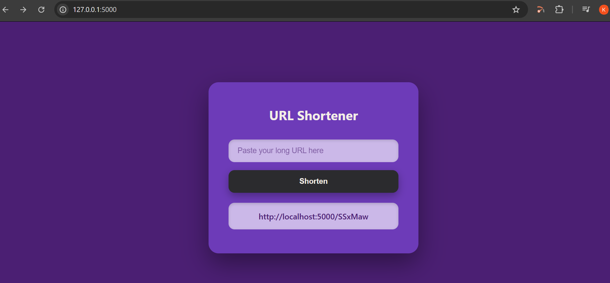

# URL Shortener

A simple URL shortener built with Flask and SQLite. Converts long URLs into short, unique codes and redirects users to the original link when the short URL is visited.

Built as part of the CodeAlpha Backend Development Internship.

## Features
- Generate a short code for any long URL
- Redirect from short URL to the original long URL
- URL mappings stored in a SQLite database
- Basic web interface to shorten URLs directly from the browser

## Tech Stack
- Python
- Flask
- Flask-SQLAlchemy
- SQLite

## Setup

Clone the repository and move into the folder:
```
git clone <repo-url>
cd url-shortener
```

Create and activate a virtual environment:
```
python -m venv venv
venv\Scripts\Activate.ps1
```

Install dependencies:
```
pip install -r requirements.txt
```

Run the app:
```
python app.py
```

The app will start on `http://localhost:5000`

## API Usage

### Shorten a URL
**POST** `/shorten`

Request body:
```json
{
  "url": "https://www.example.com/some/very/long/link"
}
```

Response:
```json
{
  "short_url": "http://localhost:5000/aB3xZ9"
}
```
## Web Interface

Visit `http://localhost:5000/` in your browser to use the URL shortener through a simple form — paste a long URL, click **Shorten**, and the shortened link appears below the form.

## Screenshot


### Access the original URL
Visit the short URL in a browser (e.g. `http://localhost:5000/aB3xZ9`) — you'll be redirected to the original long URL.

## Author
Kainat Rasheed — CodeAlpha Backend Development Intern